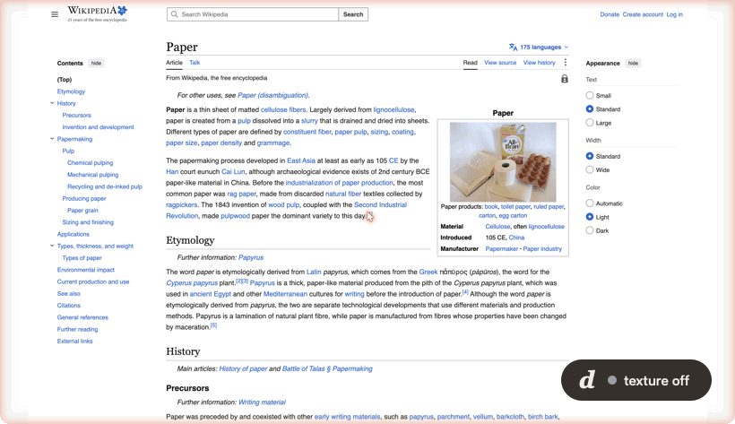
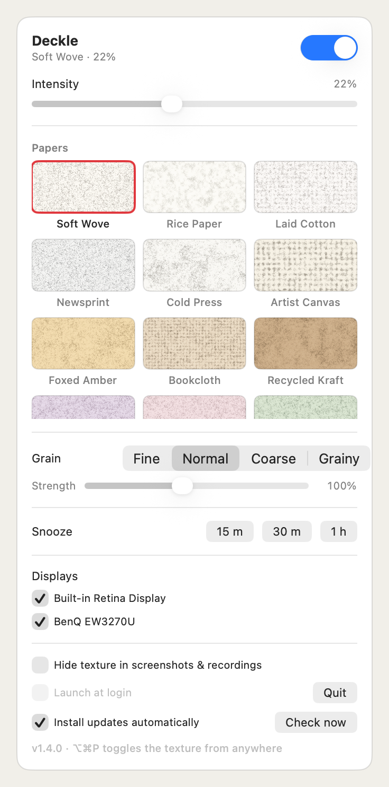

# Deckle

[](https://github.com/YellowFoxH4XOR/deckle/releases/latest)
[](https://github.com/YellowFoxH4XOR/deckle/releases)
[](LICENSE)


**[projects.akshatkatiyar.com/projects/deckle](https://projects.akshatkatiyar.com/projects/deckle/)**

A free, open-source macOS menu bar app that lays a subtle **paper-grain texture over your entire screen**, making long reading and writing sessions feel like paper instead of glass. Inspired by [Paperman](https://paperman.cc/).



*A deckle is the wooden frame used in hand papermaking — it leaves behind the soft, feathered "deckle edge" that marks real handmade paper.*

Not a blue-light filter — a *matte texture* overlay. The grain breaks up the perfectly uniform backlight glow that makes screens feel harsh, while every pixel of your work stays interactive: the overlay is fully click-through.

## Features



- **18 paper textures** in three families:
  - *Papers* — Classic Matte, Rice Paper, Whisper Weave, Newsprint, Painter's Press, Artist Canvas, Monastic Felt, Vellum Mist
  - *Warm & tinted* — Sunbaked Parchment, Saddle Linen, Recycled Kraft, Mulberry Veil, Rose Quartz, Sage Press, Nordic Sky
  - *Dark* — Carbon Ledger, Midnight Slate, Espresso
- **Intensity slider** (5–45%)
- **Global hotkey** — ⌥⌘P toggles the texture from any app
- **In-app updates** — checks GitHub Releases daily; one-click update, or turn on automatic installs
- **Capture privacy** — optionally hide the texture from screenshots and screen recordings while it stays visible to you
- **Snooze** for 15 min / 30 min / 1 h — auto-resumes
- **Multi-monitor support** with per-display on/off
- **Launch at login**
- **Click-through & lightweight** — the texture is one small tiled image; ~0% CPU at rest
- Menu-bar only: no Dock icon, no windows to manage. The paper-sheet glyph fills in when the texture is on and shows as an outline when it's off.

## Install

### Homebrew

```sh
brew tap yellowfoxh4xor/tap
brew trust yellowfoxh4xor/tap   # Homebrew 6+ asks once for third-party taps
brew install --cask deckle
```

### Download

Grab the DMG from the [latest release](https://github.com/YellowFoxH4XOR/deckle/releases/latest), open it, and drag Deckle into Applications. The app is signed with a Developer ID and notarized by Apple, so it launches without any Gatekeeper warning.

### Build from source

Requires Xcode command line tools, macOS 13+:

```sh
git clone https://github.com/<you>/deckle.git
cd deckle
make install    # builds, copies Deckle.app to /Applications, and launches
```

Or `make run` to try it from `dist/` without installing. Look for the paper-sheet icon in your menu bar.

## How it works

- One borderless, transparent `NSWindow` per display at `.screenSaver` window level (above the menu bar), with `ignoresMouseEvents = true` so all input passes through.
- The paper grain replicates SVG's `feTurbulence type="fractalNoise" baseFrequency="1.5" numOctaves="3"`: several octaves of seamlessly tileable value noise are summed, then mapped to translucent dark/light speckles. One 256×256 tile is generated per texture and tiled across the screen by the CoreAnimation render server, so memory stays flat no matter the resolution.
- The intensity slider just drives the overlay window's `alphaValue` — the texture itself is rendered once and cached.

## Development

```sh
swift run            # run unbundled (dev)
make app             # build dist/Deckle.app
make clean
```

No dependencies; pure Swift + AppKit + SwiftUI.

## Roadmap

- Circadian scheduling (auto-enable at sunset)
- Per-app exclusions

## License

[MIT](LICENSE)
