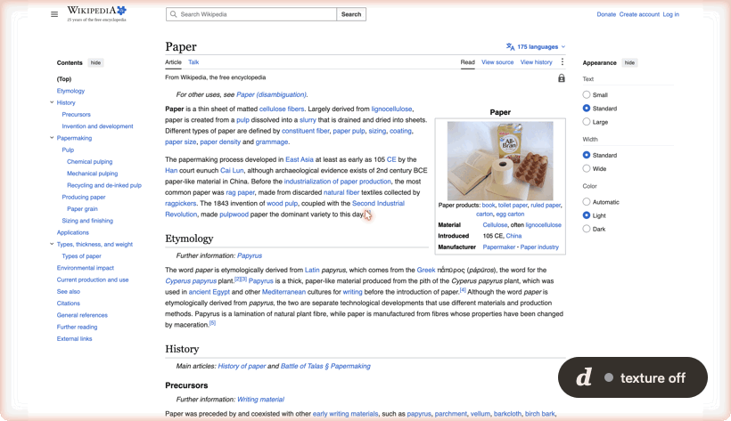
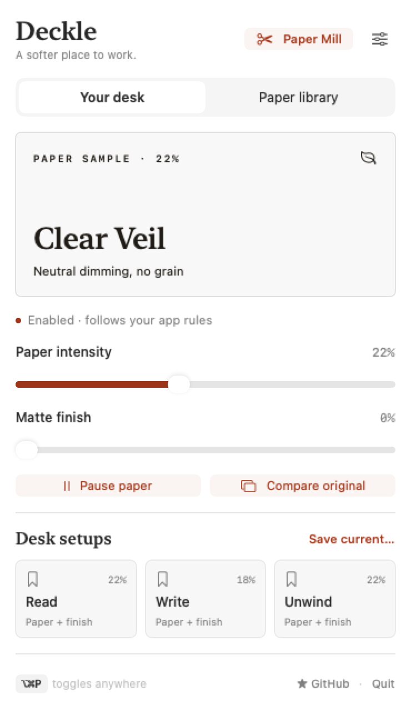
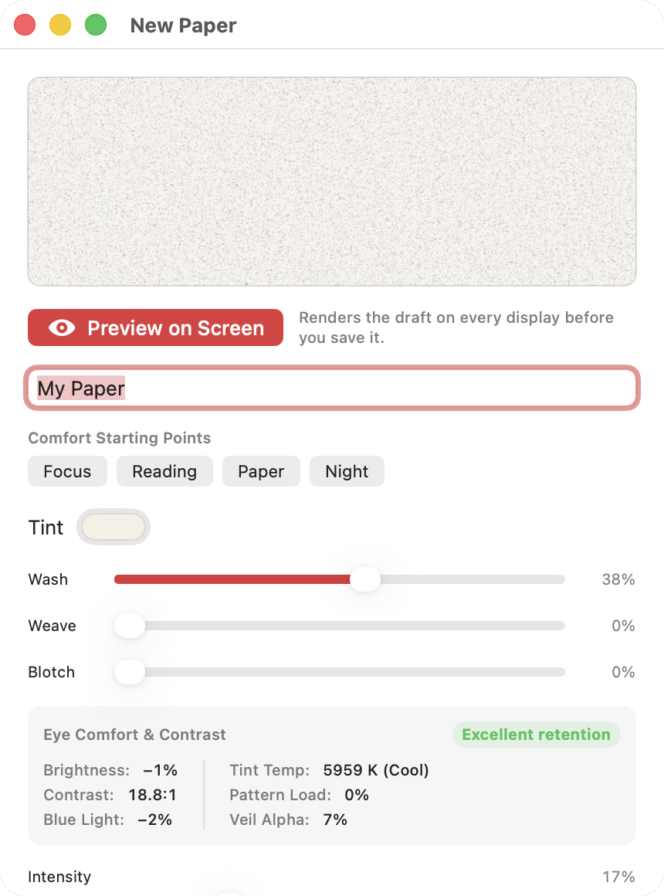
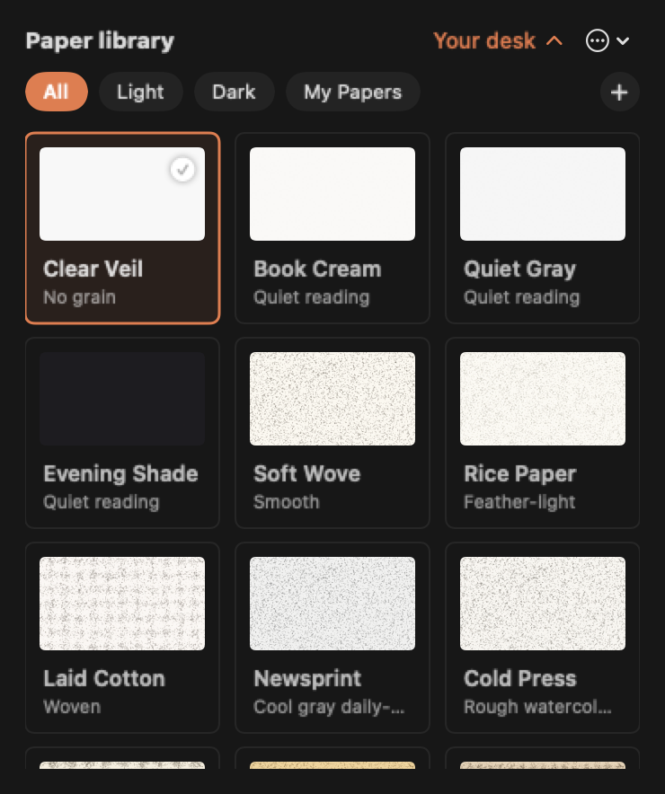
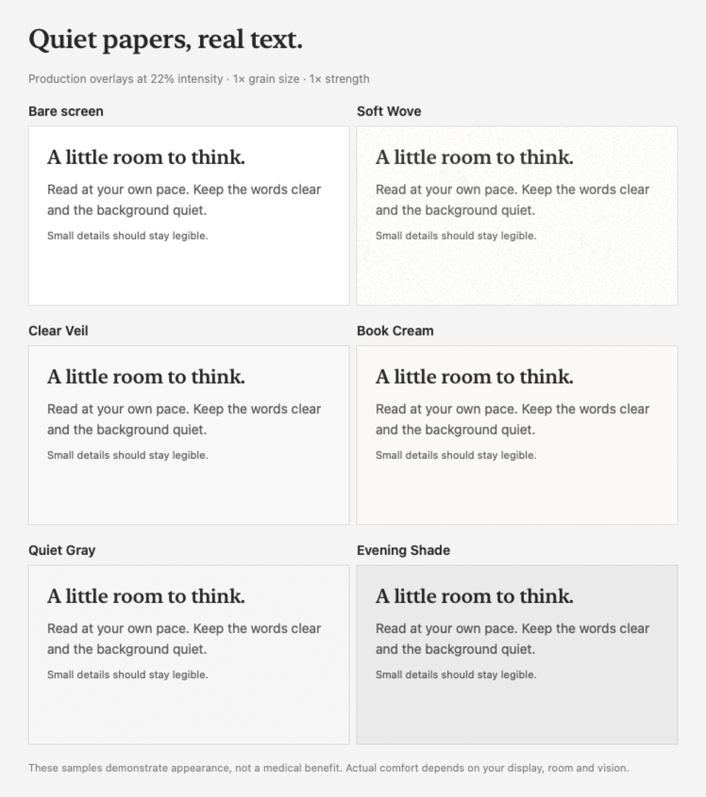

# Deckle

[](https://github.com/YellowFoxH4XOR/deckle/releases/latest)
[](https://github.com/YellowFoxH4XOR/deckle/releases)
[](LICENSE)


**[projects.akshatkatiyar.com/projects/deckle](https://projects.akshatkatiyar.com/projects/deckle/)**

A free, open-source macOS menu bar app that lays a subtle **paper-grain texture over your entire screen**, making long reading and writing sessions feel more like paper than glass. Choose a paper, tune your desk, and save the whole setup for your next reading or writing session.



> If Deckle makes your screen nicer, [a star](https://github.com/YellowFoxH4XOR/deckle) helps other people find it ⭐

*A deckle is the wooden frame used in hand papermaking — it leaves behind the soft, feathered "deckle edge" that marks real handmade paper.*

Not a calibrated blue-light filter — a *matte texture* overlay. Choose a smooth dimming veil or a textured finish; every pixel of your work stays interactive because the overlay is fully click-through. A software overlay does not change the glass’s physical reflectivity. Paper Mill reports estimated blue-channel reduction and contrast retention as design guidance, not a medical claim.

## At a glance

<table>
  <tr>
    <td width="46%" align="center"></td>
    <td width="54%" align="center"></td>
  </tr>
  <tr>
    <td align="center"><strong>Your paper, your desk.</strong><br><sub>A labelled paper sample, temporary comparison, and one-click saved setups.</sub></td>
    <td align="center"><strong>Preview before you commit.</strong><br><sub>Blend a paper on the real display, inspect its contrast, then create it.</sub></td>
  </tr>
</table>

## Features

- **Desk setups** — start with Read, Write, or Unwind, or save up to eight named combinations of paper, intensity, grain size, grain strength, and matte finish. Applying a setup enables the paper and ends a snooze; display exclusions and app rules still apply. Right-click a setup to remove it. Setups reference your saved papers, so a deleted paper must be restored before its setup can be used.
- **Compare original** — temporarily see your bare screen without changing saved settings or a snooze. Choose Back to paper or close the menu to end comparison.
- **A paper-first workspace** — Your desk presents a large labelled sample and your setups; Paper library provides browsing and search; Controls and settings keeps detailed adjustments in a separate view. Desk setups are unavailable while an unsaved Paper Mill draft is being previewed.

- **26 built-in paper textures**, including a quiet reading collection:
  - *Quiet reading* — Clear Veil (no grain), Book Cream, Quiet Gray, Evening Shade
  - *Papers* — Soft Wove, Rice Paper, Laid Cotton, Newsprint, Cold Press, Artist Canvas, Felt Side, Frost Glassine
  - *Warm & tinted* — Foxed Amber, Bookcloth, Recycled Kraft, Plum Kozo, Rose Quartz, Sage Press, Nordic Sky
  - *Dark* — Ink Stone, Midnight Slate, Espresso
  - *Spectral+ (v3)* — Gesso Ground, Linen Veil, Parchment Grain, Slate Veil — oriented fibers and surface roughness with deeper tints that cut glare
- **Searchable paper library** — search names, descriptions, IDs, and material terms, including repeated whitespace, accents, and terms in any order; filter by light, dark, or custom papers. Switching views resizes the menu to fit its content
- **Paper Mill with live screen preview** — tune tint, wash, weave, and blotch against your actual desktop before creating or saving the paper
- **Comfort guidance** — see tint-wash contrast retention, estimated luminance and blue-channel reduction, tint temperature, pattern load, and four starting recipes: Focus, Reading, Paper, and Night. Estimates exclude the separate Matte finish control.
- **Paper portability** — export custom papers as JSON, import them later, or install shared recipes from the [community papers repo](https://github.com/YellowFoxH4XOR/deckle-papers)
- **Intensity and grain controls** — intensity from 5–45%, grain size from Fine to Grainy, and independent grain strength
- **Global hotkey** — ⌥⌘P toggles the texture from any app
- **In-app updates** — Deckle checks GitHub Releases daily and installs automatically from writable app locations; otherwise it explains the blocker and offers the release page
- **Per-app rules** — hide the paper in chosen apps ("Except…") or show it only in chosen apps ("Only…")
- **Automation** — `deckle://` URL commands work from Shortcuts, Raycast, Alfred, cron, or Terminal
- **Capture privacy** — optionally hide the texture from screenshots and screen recordings while it stays visible to you
- **Snooze** for 15 min, 30 min, 1 hour, or 2 hours, then resume automatically
- **Multi-monitor support** with per-display inclusion
- **Launch at login**
- **Click-through and lightweight** — the texture is one small tiled image; Deckle uses approximately 0% CPU at rest
- **Menu-bar first** — no Dock icon or app-switcher entry; Paper Mill and Community Papers open only when requested

<p align="center"></p>
<p align="center"><sub>The studio images above are native SwiftUI review renders with isolated sample settings.</sub></p>

## Quiet reading collection

Start with **Clear Veil** for neutral dimming without grain, **Book Cream** for a faint warm finish, **Quiet Gray** for fine texture, or **Evening Shade** for deeper dimming. They appear first in Paper library; search `quiet reading` to show all four. Try 18–22% intensity and adjust to your display and room. Existing papers and saved selections are preserved.

The new presets prioritize low pattern variation and readable text. These are design choices, not clinically proven eye-strain treatments. Read the [research and rendered-tile measurements](docs/reading-presets-research.md).



## Install

### Homebrew

```sh
brew tap yellowfoxh4xor/tap
brew trust yellowfoxh4xor/tap   # Homebrew 6+ asks once for third-party taps
brew install --cask deckle
```

### Download

Grab the DMG from the [latest release](https://github.com/YellowFoxH4XOR/deckle/releases/latest), open it, and drag Deckle into Applications. The app is signed with a Developer ID and notarized by Apple, so it launches without any Gatekeeper warning.

### Build from source

Requires Xcode command line tools, macOS 13+:

```sh
git clone https://github.com/<you>/deckle.git
cd deckle
make install    # builds, copies Deckle.app to /Applications, and launches
```

Or `make run` to try it from `dist/` without installing. Look for the paper-sheet icon in your menu bar.

## How it works

- Deckle owns one borderless, transparent `NSWindow` per display at `.screenSaver` level. Each window ignores mouse events, joins every Space, and tiles one small paper image through Core Animation, so memory does not grow with display resolution.
- Built-in and newly created papers use the deterministic **spectral+ (v3) renderer**: a random-phase, Hermitian-symmetric frequency field is synthesized with Accelerate/vDSP, inverse transformed into seamless grain, then layered with woven fibers, oriented Gabor-modulated fiber bundles that darken (absorbing light like real paper fibers), and Perlin surface roughness for a deeper, matte feel. The separate Matte finish pass adjusts the final tint wash; older custom papers retain their stored spectral or legacy engine for byte-compatible grain output.
- The resulting 256×256-point tile contains both the tint wash and grain. The intensity control changes only the overlay window's `alphaValue`; identical render inputs reuse bounded caches.
- Desk setups persist alongside settings in UserDefaults. Bare-screen comparison is transient and ends when the menu closes.
- Paper Mill previews an unsaved draft through the same overlay windows used by saved papers. Preview state is transient, respects excluded displays, and is torn down when the editor closes or the draft is cancelled.
- **Energy design:** after setup, the retained-mode overlay renders nothing per frame. Update checks use `NSBackgroundActivityScheduler`; ordinary overlay changes are coalesced, and Paper Mill draft pushes are debounced to avoid regenerating spectral fields for every slider event.

## Automation

Anything that can open a URL can drive Deckle — Shortcuts' "Open URL" action, `open` in Terminal, Raycast, Alfred, cron:

```
deckle://on | off | toggle
deckle://snooze?minutes=30      deckle://resume
deckle://texture?name=Ink%20Stone
deckle://intensity?percent=25
deckle://grain?size=2&strength=1.2
```

Non-finite numeric inputs such as `nan` or `inf` are ignored. Values outside the supported finite range are clamped; existing invalid numeric preferences recover to safe defaults on launch.

Examples: a Shortcuts personal automation "At sunset → Open URL `deckle://on`" gives you circadian scheduling; "When Work Focus turns on → `deckle://texture?name=Soft%20Wove`" pairs papers with contexts.

## Development

```sh
swift run            # run unbundled (dev)
make app             # build dist/Deckle.app
make clean
```

No dependencies; pure Swift + AppKit + SwiftUI.

Regenerate the isolated native studio review renders with:

```sh
DECKLE_RENDER_DIR="$PWD/docs" swift test --filter StudioRenderTests
```

These renders check appearance; they do not replace testing menu-bar dismissal,
screen geometry, and live overlay behavior in the bundled app.

## Roadmap

- Battery auto-disable & Low Power Mode awareness
- Built-in sunset scheduling (today: use a Shortcuts automation with `deckle://on`)

## Contributing

The easiest PR: [share a paper recipe](https://github.com/YellowFoxH4XOR/deckle-papers) — 10 lines of JSON, no Swift needed. For code, see [CONTRIBUTING.md](CONTRIBUTING.md) and the [good first issues](https://github.com/YellowFoxH4XOR/deckle/labels/good%20first%20issue). Questions and ideas → [Discussions](https://github.com/YellowFoxH4XOR/deckle/discussions).

## License

[MIT](LICENSE)
